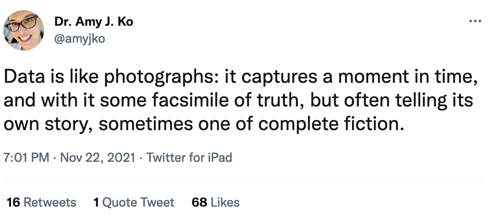
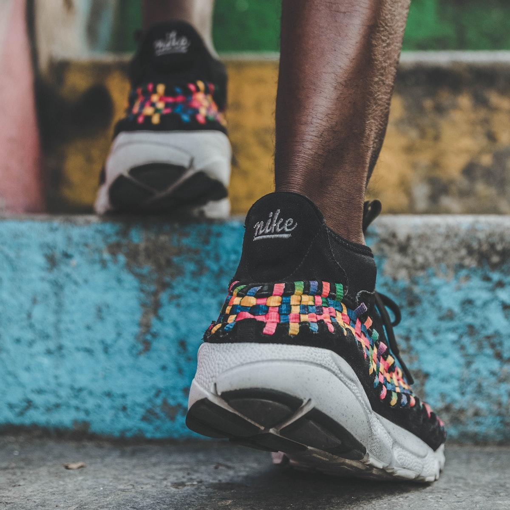

```{r setup, include=FALSE}
usethis::use_git_ignore(c("*.csv", "*.rds"))
options(htmltools.dir.version = FALSE)

library(knitr)
library(tidyverse)
library(xaringan)
library(fontawesome)
```

class: inverse, center, middle

# `r fa("far fa-images", fill = "#fff")`

**View the slides:** 

[bretsw.github.io/eme6356-ss22-module7](https://bretsw.github.io/eme6356-ss22-module7)

---

# Data Stories

```{r, out.width = "100%", echo = FALSE, fig.align = "center"}

```

>Data is like photographs: it captures a moment in time, and with it some facsimile of truth, but often telling its own story, sometimes one of complete fiction.

(Tweet from [@amyjko](https://twitter.com/amyjko/status/1462934403227668485))

---

class: inverse, center, middle

# `r fa("thumbs-up", fill = "#fff")` <br><br> Module 6 Discussion <br> Themes and Kudos

---

class: inverse, center, middle

# `r fa("far fa-question-circle", fill = "#fff")` <br><br> Module 6 Discussion <br> Final Thoughts?

---

class: inverse, center, middle

# `r fa("fas fa-rocket", fill = "#fff")` <br><br> The Future

---
class: inverse, center, middle

#  `r fa("fas fa-exclamation-circle", fill = "#fff")` <br><br> Challenge \#1: <br> **"Participant" "Rights"**

---

# Privacy

```{r, out.width = "600px", echo = FALSE, fig.align = "center"}
include_graphics("img/surveillance.jpg")
```

--

- What rights to live and behave from observation?

--

- Opt-in, or opt-out?

---

# Openness and Societal Benefit

```{r, out.width = "600px", echo = FALSE, fig.align = "center"}
include_graphics("img/traffic.jpg")
```

--

- Example: Traffic data

--

  - Looking at aggregate or individual?

---

# Data Accessibility

```{r, out.width = "600px", echo = FALSE, fig.align = "center"}

```

--

- Who has access? Who gives feedback? Who benefits?

---

# Ownership

```{r, out.width = "600px", echo = FALSE, fig.align = "center"}

```

--

- Who **controls** my data?

--

- Who **profits** from it?

---

# Agency

```{r, out.width = "420px", echo = FALSE, fig.align = "center"}

```

--

- How much initiative can be expected?

--

- How does the need to be purposeful fall unevenly?

---

class: inverse, center, middle

#  `r fa("fas fa-exclamation-circle", fill = "#fff")` <br><br> Challenge \#2: <br> **Ethical Use of Data**

---

# Consent

```{r, out.width = "600px", echo = FALSE, fig.align = "center"}

```

--

- Should we ask people for consent to observe them?

--

- What are their expectations for being in public?

--

- What is ok to collect? What forms of analysis are ethical?

---

# Transparency

```{r, out.width = "600px", echo = FALSE, fig.align = "center"}

```

--

- Those who collect data should be open about when collecting or observing

--

- Analysis should be open as well

---

# Regulation

```{r, out.width = "600px", echo = FALSE, fig.align = "center"}

```

--

- Transparency is not enough: need regulation or moderation

--

- Peer/community review, government oversight, etc.

---

class: inverse, center, middle

#  `r fa("fas fa-exclamation-circle", fill = "#fff")` <br><br> Challenge \#3: <br> **Real Impact**

---

# Learning and Performance

```{r, out.width = "600px", echo = FALSE, fig.align = "center"}

```

--

- Is learning simply the vocabulary on a grocery list?

---

# Evidence for Conclusions

```{r, out.width = "600px", echo = FALSE, fig.align = "center"}
include_graphics("img/crack.jpg")
```

--

- Can't speak to motivations or answer "Why?"

--

- Statistical significance vs. practical significance: mean of 69% vs 76%

---

# Challenges in Deployment

```{r, out.width = "600px", echo = FALSE, fig.align = "center"}
include_graphics("img/spill.jpg")
```

--

- Development time, support needed, rapid innovation

--

- Need to view as a system

---

# Applications: Teaching/Training

```{r, out.width = "600px", echo = FALSE, fig.align = "center"}
include_graphics("img/help.jpg")
```

--

- Feedback needs to immediate, clear, and actionable

--

- Give **teachers/instructors** a voice in identifying key performance indicators

---

# Robots Replacing Teachers?

```{r, out.width = "100%", echo = FALSE, fig.align = "center"}
include_graphics("img/robot.jpg")
```

---

# AI Giving an Extra Nudge

```{r, out.width = "100%", echo = FALSE, fig.align = "center"}

```

---

# Applications: Performance

```{r, out.width = "600px", echo = FALSE, fig.align = "center"}
include_graphics("img/help.jpg")
```

--

- Feedback needs to immediate, clear, and actionable (e.g., adaptive learning)

--

- Give **students/learners** options for filtering analyses

---

# Impact on Institutions

```{r, out.width = "600px", echo = FALSE, fig.align = "center"}
include_graphics("img/help.jpg")
```

--

- Should benefit to institutions be primary or secondary?

---

class: inverse, center, middle

# Future of Analytics

```{r, out.width = "600px", echo = FALSE, fig.align = "center"}
include_graphics("img/future-research.jpg")
```

What **should** be the role of analytics?

---

class: inverse, center, middle

# `r fa("fas fa-binoculars", fill = "#fff")` <br><br> Looking Ahead

---

# Semester schedule

```{r, out.width = "100%", echo = FALSE, fig.align = "center"}
include_graphics("img/across-time.jpg")
```

- **Module 7:** Future of Analytics
- **Module 8:** Case Discussions

---

# Major Assignments

```{r, out.width = "600px", echo = FALSE, fig.align = "center"}
include_graphics("img/build.jpg")
```

### Analytics Assignments

--

- Analytics Case Presentation (200 points; group project) - **due April 17**

--

- Analytics Ethics Statement (100 points) - **due end of April 24**

---

class: inverse, center, middle

# `r fa("far fa-question-circle", fill = "#fff")` <br><br> Questions

<hr>

**What questions can I answer for you now?**

**How can I support you this week?**

<hr>

`r fa("envelope", fill = "#fff")` [bret.staudtwillet@fsu.edu](mailto:bret.staudtwillet@fsu.edu) | `r fa("twitter", fill = "#fff")` [@bretsw](https://twitter.com/bretsw) | `r fa("globe", fill = "#fff")` [bretsw.com](http://bretsw.com) | `r fa("fab fa-github", fill = "#fff")` [GitHub](https://github.com/bretsw/)